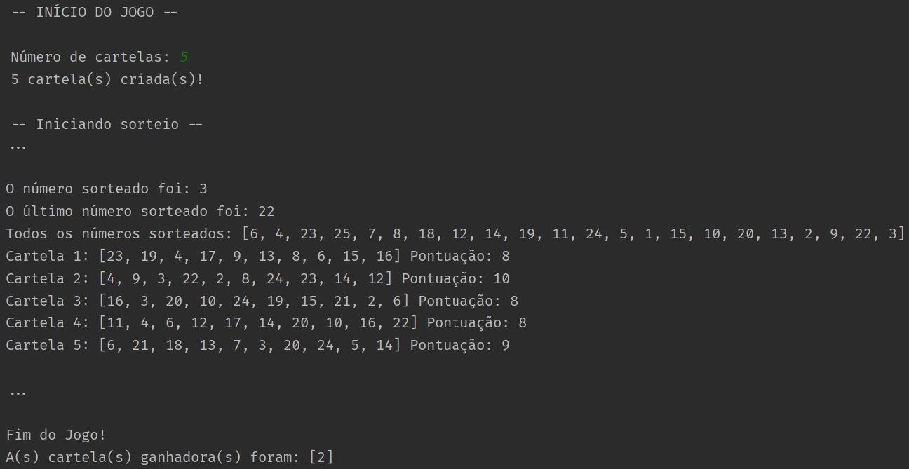

# projeto-ape
 Projeto da disciplina de Algoritmo e Programação Estruturada do primeiro semestre do curso de Sistemas para Internet no IFPB.

 Bingo Feito em Python no terminal usando as bibliotecas "random" e "time" para geração aleatória de números e efeitos visuais respectivamente.

